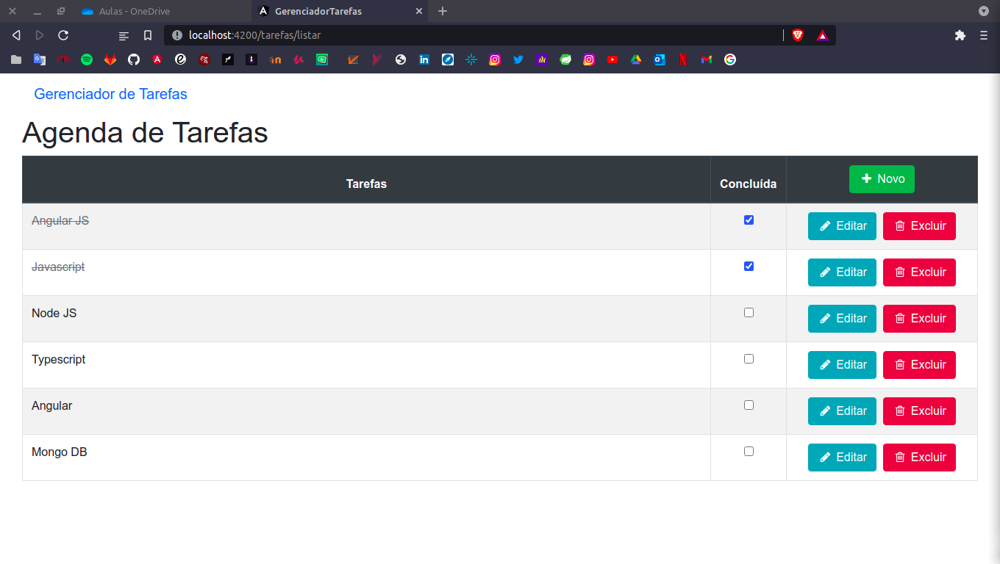

# Gerenciador de Tarefas



## Descrição

Projeto criado no curso de Angular 11 da Udemy, ministrado por Márcio Casale de Souza e tem como objetivo: auxiliar na organização de tarefas. Esta aplicação foi criada utilizando Angular 11, Typescript, Sweet Alert 2 e Bootstrap 4. Foi utilizado recursos das versões mais recentes do ES6 como Arrow Functions, Promises e Async/Wait. Está aplicação possui um CRUD que faz o armazenamento dos dados no Local Storage do navegador.

## Instalação

Este é um projeto web e não precisa ser instalado, porém, se quiser baixar e instalar o projeto para testes locais, primeiro certifique-se de que tenha o Node.js e Angular-cli instalados em sua máquina. Segundo, baixe o projeto e descompacte-o, em seguida, abra um terminal no diretório onde baixou e rode o comando a seguir para baixar as dependências do projeto:

```
npm install
```
Para rodar o projeto localmente digete o seguinte comando no terminal ainda dentro do diretório do projeto:

```
ng serve
```

Depois abra o navegador no seguinte link: [https://localhost:4200](https://localhost:4200)


## Contribuidores

[Luciano Brito](https://github.com/LucianoAparecidoBritoGuedes/)

Nascido em 1991 em Luziânia-GO, Brasil. Apaixonado por tecnologia e open-source. Graduado em Análise e Desenvolvimento de sistemas pela Universidade Paulista (UNIP) em 2019.


## Contatos

- [LinkeIn](https://www.linkedin.com/in/luciano-brito-dev)
- [Gmail](lucianobrito.dev@gmail.com)


## Doações

[](https://www.paypal.com/cgi-bin/webscr?cmd=_s-xclic&hosted_button_id=RXA28WZH3XF4E)
